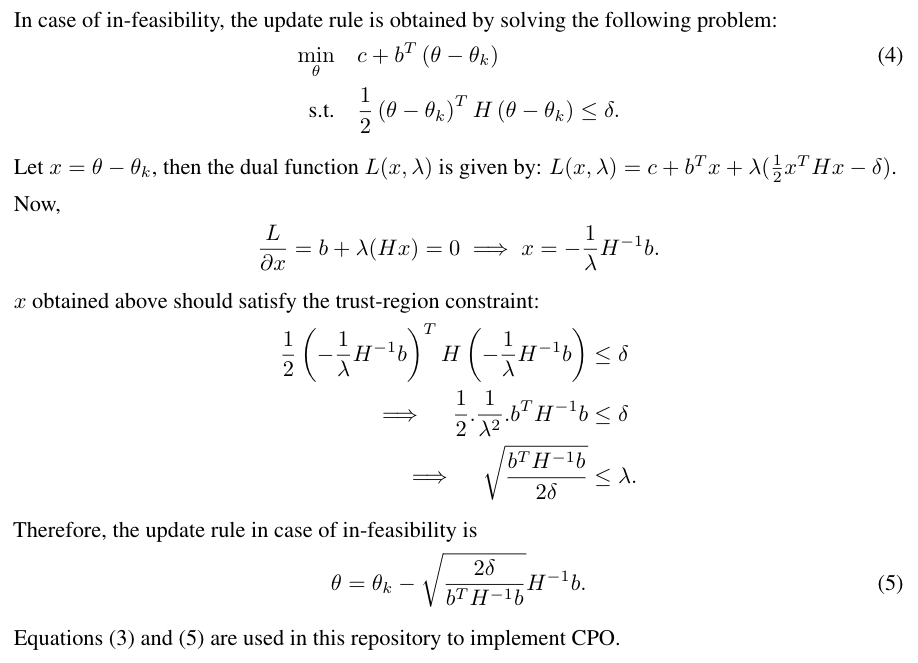

# PyTorch implementation of Constrained Policy Optimization (CPO)
This repository has a simple to understand and use implementation of [CPO](https://arxiv.org/abs/1705.10528) in PyTorch. A dummy constraint function is included and can be adapted based on your needs. 

## Pre-requisites
- [PyTorch](https://pytorch.org/get-started/previous-versions/#v120) (The code is tested on PyTorch 1.2.0.) 
- OpenAI [Gym](https://github.com/openai/gym).
- MuJoCo [(mujoco-py)](https://github.com/openai/mujoco-py)
- If working with a GPU, set OMP_NUM_THREADS to 1 using:
```
export OMP_NUM_THREADS=1
```

## Features 
1. Tensorboard integration to track learning.
2. Best model is tracked and saved using the value and standard deviation of average reward.

### Usage
* python algos/main.py --env-name CartPole-v1 --algo-name=CPO --exp-num=1 --exp-name=CPO/CartPole --save-intermediate-model=10 --gpu-index=0 --max-iter=500

### Code Reference
* [Khrylx/PyTorch-RL](https://github.com/Khrylx/PyTorch-RL)

### Technical Details on CPO




